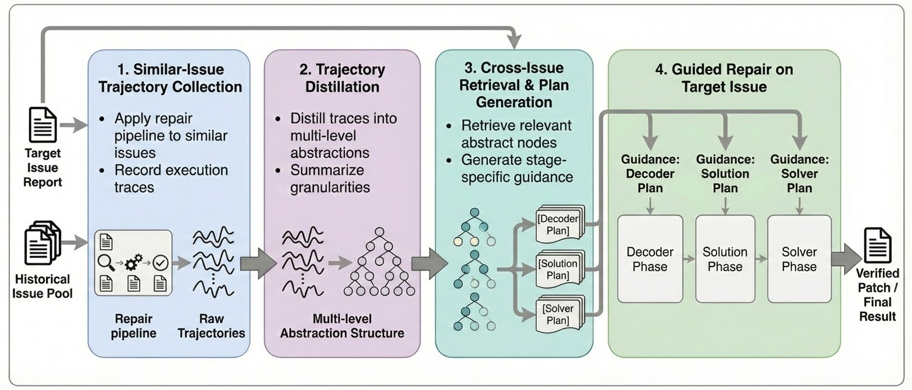

[](https://deepwiki.com/nimasteryang/Lingxi)

# Lingxi: Knowledge-Guided Multi-Agent Framework for Repository-Level Issue Resolution

**Lingxi** is an open-source, multi-agent framework that automates repository-level software issue resolution. It decomposes the repair workflow into specialized agents and leverages historical development knowledge to guide the repair process.

Lingxi has evolved through two major versions:
- **Lingxi v1.5** mines transferable procedural knowledge from historical issue-patch pairs and uses multiple analysis agents to examine the target issue from different perspectives, achieving **74.6% Pass@1** on SWE-bench Verified.
- **Lingxi v2.0** introduces a *trajectory-to-guidance* mechanism that distills stage-aware procedural guidance from historical repair trajectories, achieving **81.2% Pass@1** on SWE-bench Verified -- the **first autonomous agent to exceed 80%** on this benchmark.

---

## Key Results

| Version | Backbone Model | Pass@1 (%) | Leaderboard |
|---------|---------------|-----------|-------------|
| **Lingxi v2.0** | MiniMax M2.5 (HR) | **81.2** | **#1** |
| Lingxi v1.5 | Claude 4 Sonnet | 74.6 | - |

### Lingxi v2.0 vs. State-of-the-Art

| Approach | Backbone Model | Pass@1 (%) |
|----------|---------------|-----------|
| **Lingxi v2.0** | **MiniMax M2.5 (HR)** | **81.2** |
| live-SWE-agent | Claude 4.5 Opus (Medium) | 79.2 |
| Sonar Foundation Agent | Claude 4.5 Opus | 79.2 |
| TRAE | Doubao-Seed-Code | 78.8 |
| mini-SWE-agent v2 | MiniMax M2.5 (HR) | 75.8 |
| Lingxi v1.5 | Claude 4 Sonnet | 74.6 |

---

## Lingxi v1.5 -- Knowledge-Guided Analysis Scaling


Lingxi v1.5 builds on two key observations: (1) once a model has a clear edit plan, the code edit usually works if the root cause is correctly located; (2) single-agent pipelines suffer from **context dilution** -- by the time the model reaches code editing, earlier discussion tokens dominate the prompt. Lingxi addresses these by focusing on precise root-cause analysis through historical knowledge, and splitting the workflow into compact, purpose-built agents.

**Historical Development Knowledge** -- A module searches the project's history for similar issues and their patches, reverse-engineers the underlying development knowledge, and injects it as a prior into multiple Problem Decoder agents. Each agent analyzes the issue from a different perspective. An Aggregate module merges these analyses into a single comprehensive report, from which the Solution Mapper and Problem Solver generate one accurate patch.

**Multi-Agent Design Principles** -- Each agent gets a crystal-clear contract (mandatory inputs, expected outputs, and the *only* tools it may call). After every agent, the coordinator compresses conversation history to thinking, observations, and actions, discarding verbose tool-call results. Every prompt reminds the agent of the team composition and urges it to stay within scope.

**Tooling Philosophy** -- Lingxi follows a "minimal tool set, maximal information" approach. Tools are designed to provide accurate, sufficient information per call so that the LLM needs fewer steps. All tools are exposed through structured function-calling.

---

## Lingxi v2.0 -- Trajectory-to-Guidance



V1.5's pattern-oriented knowledge compresses history into high-level takeaways, which can omit stage-dependent details or mislead the agent when the retrieved patterns don't fit. V2.0 addresses this with a **trajectory-to-guidance** mechanism that distills **stage-aware procedural guidance** from repair trajectories -- focusing on *how to localize, validate, and iterate* rather than only listing fix patterns.

The system follows four phases:

1. **Trajectory Collection** -- For similar historical issues, execute the Lingxi repair pipeline and record the complete problem-solving trace, stored in stage-aligned form (Decoder, Solution, Solver).

2. **Trajectory Distillation** -- Distill each trajectory into a multi-level abstraction tree: lower levels retain concrete diagnostic sub-goals, middle levels capture broader investigation strategies, and the top level distills general problem-solving principles. Each node also carries **pitfall warnings** from the original repair.

3. **Retrieval & Plan Generation** -- For each repair stage, retrieve relevant abstracted nodes via rule-based scoring + LLM-based verification, then generate a **stage-specific plan** adapted to the target issue's context.

4. **Guided Repair** -- Inject plans into each stage as structured guidance. Plans inform but do not rigidly determine the repair -- the agent adapts based on newly observed evidence. Completed trajectories are abstracted back for future reuse.

---

## Publications & Resources

- **Lingxi v1.5**: *Lingxi: Repository-Level Issue Resolution Framework Enhanced by Procedural Knowledge Guided Scaling.* [Paper (arXiv)](https://arxiv.org/abs/2510.11838) | [Technical Report (PDF)](docs/Lingxi%20v1.5%20Technical%20Report%20200725.pdf) | [Replication Package (Zenodo)](https://doi.org/10.5281/zenodo.16777249)
- **Lingxi v2.0**: *Trajectory Abstraction for Guidance-Driven Repository-Level Issue Resolution.* [Technical Report (PDF)](docs/Lingxi%20v2.0%20Technical%20Report%202026.pdf) | Paper coming soon
- **SWE-bench Submission**: [SWE-bench/experiments#432](https://github.com/SWE-bench/experiments/pull/432)

---

## Setup

### 1. Install Dependencies

```bash
# Using pip
cd Lingxi && pip install -e .

# Or using uv (recommended)
uv sync
```

### 2. Configure Environment Variables

Create a `.env` file in the project root:

```bash
# LLM Configuration
LLM_PROVIDER=anthropic          # Options: "anthropic", "openai", "deepseek"
LLM_MODEL=claude-3-5-haiku-latest

# API Keys (set the one matching your LLM_PROVIDER)
ANTHROPIC_API_KEY=your_key_here
OPENAI_API_KEY=your_key_here    # Also required for embeddings (text-embedding-3-small)
# DEEPSEEK_API_KEY=your_key_here

# GitHub Access
GITHUB_TOKEN=your_token_here    # Profile > Settings > Developer Settings > Personal access tokens
```

### 3. Run

```bash
# Using pip installation
langgraph dev --no-reload

# Using uv
uv run --env-file .env langgraph dev --no-reload
```

This starts a local LangGraph Studio instance and opens the UI in your browser.

### 4. Usage

1. Select a graph from the top-left dropdown:
   

2. Click **"+ Message"** and paste a GitHub issue URL (e.g., `https://github.com/gitpython-developers/GitPython/issues/1977`):
   

3. Click **Submit**.

> **Human-in-the-loop**: Disabled by default. Enable via the checkbox in the LangGraph Studio UI before submitting:
> 

---

## Architecture

### Agent System

| Agent | Role | Tools |
|-------|------|-------|
| **Supervisor** | Routes workflow between agents based on progress | - |
| **Problem Decoder** | Analyzes issues, performs bug localization | `view_directory`, `search_relevant_files`, `view_file_content` |
| **Solution Mapper** | Creates detailed code change plans | `view_directory`, `search_relevant_files`, `view_file_content` |
| **Problem Solver** | Implements code changes | `view_directory`, `search_relevant_files`, `str_replace_editor` |
| **Reviewer** | Validates fixes and runs tests (hierarchy graph only) | `view_directory`, `search_relevant_files`, `view_file_content`, `run_shell_cmd` |
| **Multi-Agent Manager** | Coordinates resolver and reviewer (hierarchy graph only) | - |

### Graphs

**Supervisor Graph** (`src/agent/supervisor_graph_demo.py`):


A linear workflow: `input_handler` -> `supervisor` -> `problem_decoder` -> `solution_mapper` -> `problem_solver`, with optional human feedback after each step.

**Hierarchy Graph** (`src/agent/hierarchy_graph_demo.py`):


Wraps the supervisor graph as a subgraph, adding a multi-agent manager and reviewer for iterative fix validation.

### Tool Set

| Tool | Description | Location |
|------|-------------|----------|
| `view_directory` | Explore repository tree with adaptive depth | `src/agent/tool_set/sepl_tools.py` |
| `view_file_content` | Inspect file text, auto-truncates long files | `src/agent/tool_set/sepl_tools.py` |
| `search_files_by_keywords` | Multi-keyword semantic search via ripgrep | `src/agent/tool_set/sepl_tools.py` |
| `str_replace_editor` | Apply code edits (view, create, replace, insert) | `src/agent/tool_set/edit_tool.py` |
| `run_shell_cmd` | Execute sequential shell commands | `src/agent/tool_set/sepl_tools.py` |

---

## Development Guide

For a comprehensive guide with code examples on adding agents, tools, and graphs, see [docs/DEVELOPMENT.md](docs/DEVELOPMENT.md). For detailed file-level documentation, see [CLAUDE.md](CLAUDE.md).

### Quick Reference

- **Adding agents**: Create prompt in `src/agent/prompt/`, define tools, use `create_react_agent()`, add node to `StateGraph`
- **Creating graphs**: Define `StateGraph`, add nodes/edges, compile, register in `langgraph.json`
- **Adding tools**: Use `@tool` decorator with docstrings, link to agents via `tools` parameter

### Code Quality

```bash
ruff check src/    # Linting
ruff format src/   # Formatting
mypy src/          # Type checking
pytest             # Testing
```

---

## Project Structure

```
.
├── langgraph.json              # LangGraph configuration
├── pyproject.toml              # Dependencies
├── docs/                       # Technical reports and figures
└── src/agent/
    ├── supervisor_graph_demo.py # Primary workflow graph
    ├── hierarchy_graph_demo.py  # Extended workflow with reviewer
    ├── state.py                 # LangGraph state definitions
    ├── llm.py                   # LLM provider configuration
    ├── runtime_config.py        # Environment setup (singleton)
    ├── prompt/                  # Agent system prompts
    ├── tool_set/                # Agent tools
    │   ├── sepl_tools.py        # Core development tools
    │   ├── context_tools.py     # Vector search & knowledge management
    │   ├── edit_tool.py         # File editing (OHEditor)
    │   └── linter/              # Code quality tools
    └── utils.py                 # Helper functions
```

## Notes

- **Storage**: Cloned repositories and ChromaDB instances are stored at the path defined in `src/agent/constant.py:RUNTIME_DIR`. Clean this directory periodically to manage disk space.
- **Embeddings**: The `search_relevant_files` tool requires OpenAI API access to the `text-embedding-3-small` model.
- **Additional providers**: LLM integrations beyond the built-in ones can be added via [LangChain Chat Models](https://python.langchain.com/docs/integrations/chat/).
